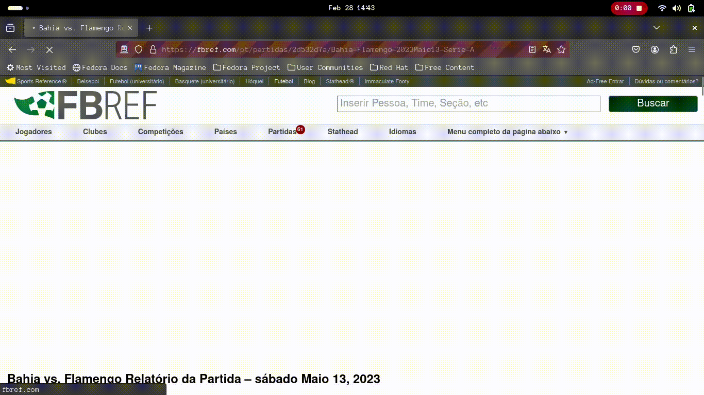

# Parte I: Obtenção dos dados
###### Obtenção dos dados do time do flamengo no brasileirão 2023.
---

Para a coleta dos dados do Mengão no Brasileirão 2023, eu fiz um web scrapping utilizando o Selenium.  

Foi coletado o seguinte:
- Estatísticas das partidas do flamengo no site da [FBref.](https://fbref.com/pt/)
- Baixei as súmulas online do site da [CBF](https://www.cbf.com.br/) utilizando a página que continha o link para o download desses arquivos na [Wikipédia.](https://pt.wikipedia.org/wiki/Temporada_do_Clube_de_Regatas_do_Flamengo_de_2023#Campeonato_Brasileiro_2)
- As súmulas foram usadas para pegar as informações dos cartões e substituições das partidas.
- A informações do público e renda foram coletadas do site da [Wikipédia.](https://pt.wikipedia.org/wiki/Temporada_do_Clube_de_Regatas_do_Flamengo_de_2023#Campeonato_Brasileiro_2)

Abaixo, você pode ver dois gifs do script do web scrapping em ação. O primeiro baixa as súmulas e o segundo coleta as estatíticas das partidas.

  

  

Para fazer a leitura das informações dos cartões e das substituições das súmulas que são arquivos pdfs, eu utilizei a bibioteca [`pdfplumber`](https://pypi.org/project/pdfplumber/) e depois utilizei o [`pandas`](https://pandas.pydata.org/) para gravar as informações em arquivos csvs. Também utilizei a biblioteca [`pathlib`](https://docs.python.org/3/library/pathlib.html) para renomear os arquivos de acordo com a rodada.

Alguns arquivos deram problemas, que foram os arquivos da rodada 6 e 15, então como era poucas informações eu optei por colocar as informações desses dois arquivos manualmente no csv. 
{: .bubble-note}

As informações das estatísticas das partidas eu gravei em arquivos txt e utilizei o [`pandas`](https://pandas.pydata.org/) para gravar essas informações em um `DataFrame`.  

Para juntar todas essas informações eu utilizei a função `pd.concat()` do pandas para juntar as informações em um único `DataFrame` e gravei em um arquivo csv chamado `estatisticas_flamengo_brasileiro_2023.csv`.  

O repositório do projeto você pode conferir [aqui.](https://github.com/Fabio-luiz-sousa/flamengo_analysis_brasileiro_2023)
{: .bubble-tip}

