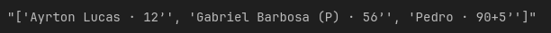
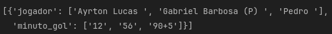
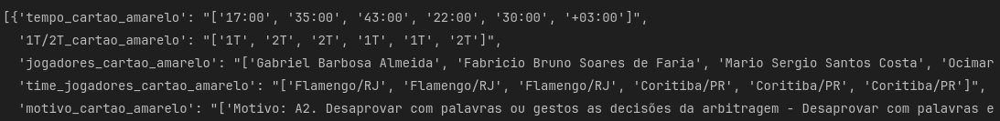
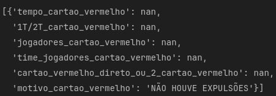
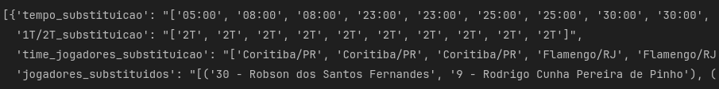

# Parte II: Tratamento dos dados
###### Tratamendo dos dados que foram obtidos através do webscrapping.
---

Nessa parte II, eu fiz um tratamento geral nos dados para facilitar na hora de se fazer a análise exploratória (parte III).
Os tratamentos que foram feitos são:
- Mudei as colunas com dados numéricos para o tipo correto e também mudei a coluna referente a data para o tipo correto correspondente.
- Juntei as colunas `data_jogo` e `horario_jogo` em uma coluna só chamada `data_horario_jogo`.
- Algumas colunas estavam com os dados com informações redundantes, por exemplo a coluna var_jogo em seus dados tinha  'nome do árbitro (VAR)' e como o nome da coluna já explicita o que o dado se refere removi essas informações redundantes.
- Na coluna `gols_jogo` as informações estavam dessa maneira:  então optei em fazer um dicionário para as informações ficarem melhores separadas, ficando assim: 
- Também juntei todas as informações sobre os cartões amarelos em uma coluna chamada `info_cartoes_amarelos`, sobre os cartões vermelhos em uma coluna chamada `info_cartoes_vermelhos` e sobre as substituições em uma coluna chamada `info_substituicoes. As informações ficaram assim, respectivamente:
  

  

  

As imagens sobre os cartões amarelos e substituições ficaram cortadas, pois as informações são muito grandes e não couberam no print.
{: .bubble-note}  

O notebook dessa parte II você pode conferir [aqui.](https://github.com/Fabio-luiz-sousa/flamengo_analysis_brasileiro_2023/blob/main/part_2_data_cleaning/data_cleaning.ipynb)  
O repositório do projeto você pode conferir [aqui.](https://github.com/Fabio-luiz-sousa/flamengo_analysis_brasileiro_2023)
{: .bubble-tip}
